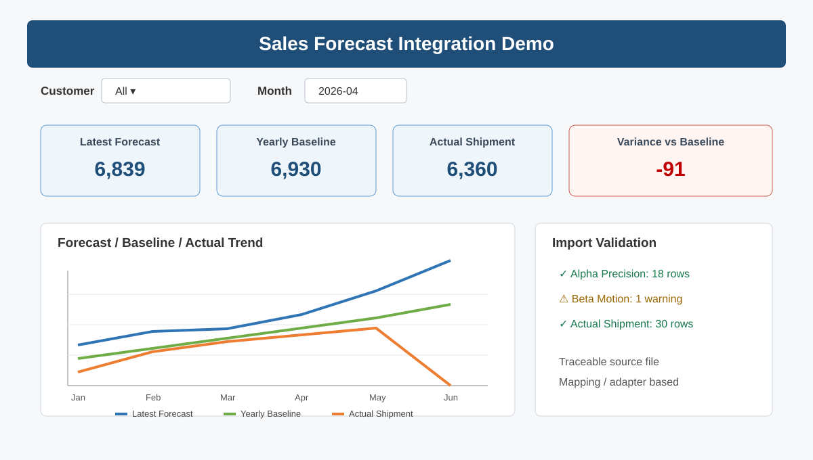

# Excel Forecast Automation Demo

A portfolio demonstration for **multi-source Excel forecast integration, normalization, comparison, validation, and reporting**.

> All customer names, part numbers, quantities, and files in this demo are synthetic. This is not client data and is not presented as a completed client engagement.



## Scenario

A manufacturing sales team receives forecast data from multiple customers, but each customer uses a different Excel layout. The internal team also maintains:

- yearly forecast / baseline data
- actual shipment data
- part-number master data
- repeated weekly or monthly forecast updates

The goal is to reduce manual copy/paste work by standardizing the incoming files and producing one auditable comparison table and dashboard.

## Demonstrated design

```text
Customer A: matrix-style forecast ─┐
Customer B: long-format forecast  ─┼─> Import / Adapter Layer
Other customer formats            ─┘          │
                                               v
                                       Standardized Data
                                               │
                    ┌──────────────────────────┼─────────────────────────┐
                    v                          v                         v
              Yearly Baseline            Actual Shipment           Part Master
                    └──────────────────────────┼─────────────────────────┘
                                               v
                                   Validation & Reconciliation
                                               v
                                  Dashboard / Report / History
```

The key idea is to use **mapping/adapters instead of hard-coding fixed cell positions**. New customer formats can therefore be added without rewriting the entire workbook.

## Demo workbook

Download: [`Forecast_Automation_Demo.xlsx`](demo/Forecast_Automation_Demo.xlsx)

The workbook contains:

- `Dashboard` — KPI summary, trend table, and chart
- `StandardizedData` — normalized customer / part / month records
- `MappingConfig` — example parser and header mappings
- `PartMaster` — customer part number to internal part number mapping
- `Raw_Alpha` — matrix-style customer forecast
- `Raw_Beta` — long-format customer forecast
- `ImportLog` — sample import / warning history

The workbook is intentionally `.xlsx` so it can be opened safely as a static portfolio artifact. The VBA source is provided separately under `src/` as a reference implementation for a production `.xlsm` tool.

## VBA source

The `src/` folder contains a compact reference implementation showing the intended production structure:

- `modForecastMain.bas` — user-facing workflow and error handling
- `modImportAdapters.bas` — matrix and long-format import logic
- `modUtils.bas` — header detection, month normalization, part mapping, append/log helpers

A production delivery would normally expose simple buttons such as:

```text
[ Import Forecast ]
[ Import Actual ]
[ Refresh Integration ]
[ Archive Snapshot ]
[ Generate Report ]
```

## Example standard schema

| Field | Purpose |
|---|---|
| Customer | Customer name |
| InternalPartNo | Internal material / part number |
| CustomerPartNo | Customer-side part number |
| ForecastMonth | Normalized month |
| LatestForecastQty | Latest received forecast |
| ActualShipmentQty | Actual shipment quantity |
| YearlyForecastQty | Original yearly baseline |
| VarianceVsYearly | Latest forecast minus baseline |
| VariancePct | Variance percentage |
| Source | Original source filename |
| UpdatedAt | Import / update timestamp |
| Status | Validation result |

## Production hardening

For a real deployment, I would confirm these rules from sample files before fixing the implementation:

- whether blank forecast means `0` or “not provided”
- whether weekly data is summed, allocated, or kept weekly
- whether a new forecast fully replaces or partially updates the prior version
- customer-part to internal-part mapping rules
- duplicate file / duplicate row handling
- returns, negative shipments, cancellations, and other actual-shipment exceptions
- required history retention and snapshot granularity

The production version would also add stronger validation messages, structured import logs, version archiving, test cases, and user documentation.

## Sample files

Synthetic input examples are under `samples/` and demonstrate two intentionally different layouts.
